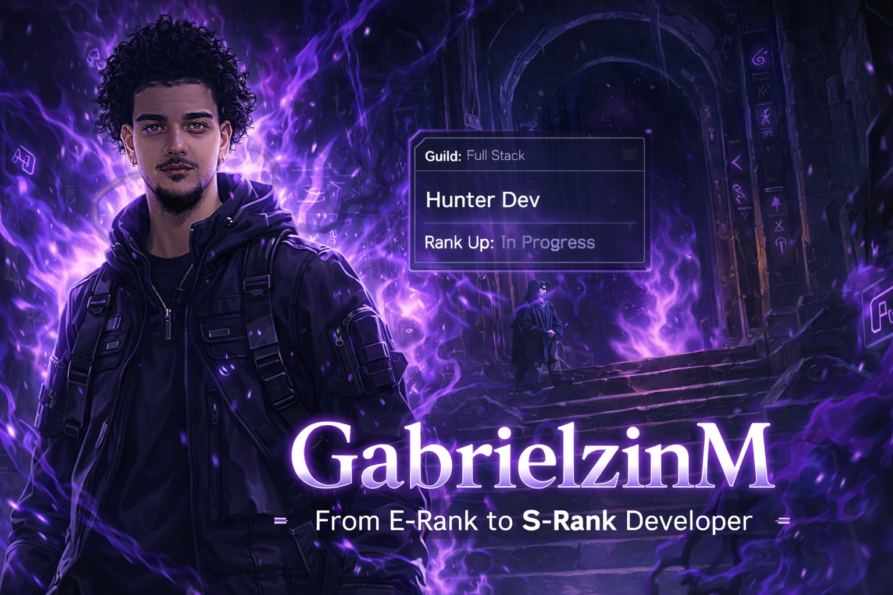

  

<h1 align="center">⚔️ GabrielzinM — Hunter Dev ⚔️</h1>

  

  

---

## 🗡️ Status do Caçador
- 🎓 **Engenharia de Software**
- 💻 **Full Stack em evolução**
- 📊 **Excel avançado / dashboards**
- 🧠 Curto construir coisa real (projetos + prática)

> “Sem grind, sem rank. Cada commit é XP.”

---

## ⚙️ Arsenal (Tech Stack)

  

---

## 📊 Dungeon Stats

  
  

  

---

## 🧩 Quests (Projetos)
- 🚀 **SaaS em construção**
- 📊 **Análise de dados / Python**
- 🎯 **Seu Guia ENEM (chatbot/UI)**
- 🎮 **Guias e conteúdos (estilo gamer)**

---

## 🧭 Contato
- 📩 Email: **SEU_EMAIL_AQUI**
- 💼 LinkedIn: **SEU_LINK_AQUI**
